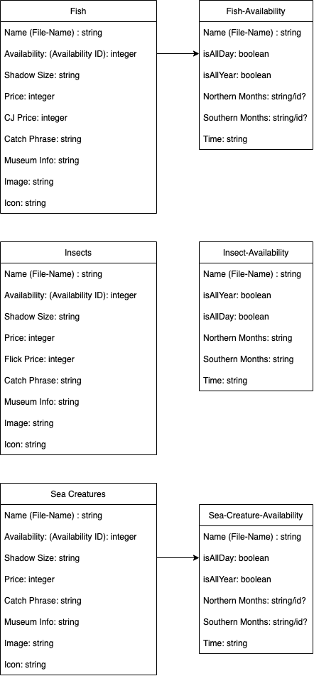
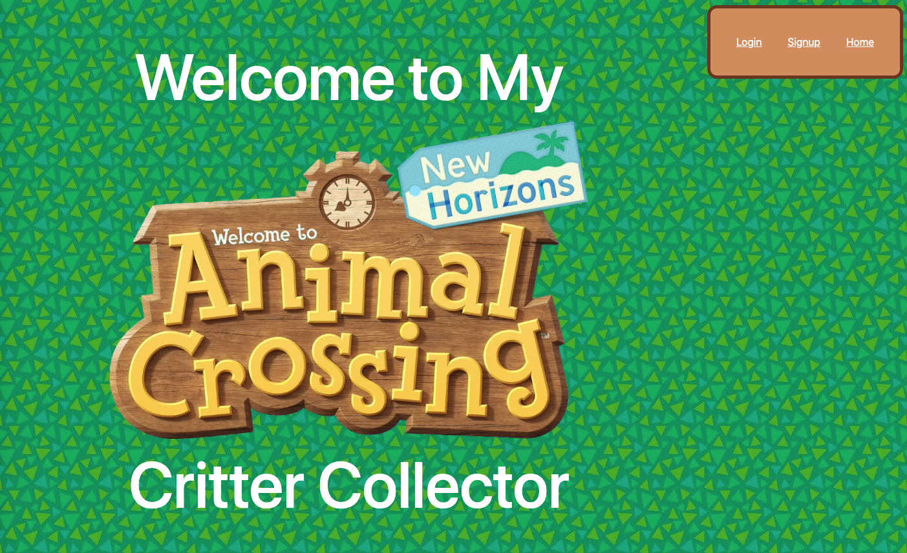
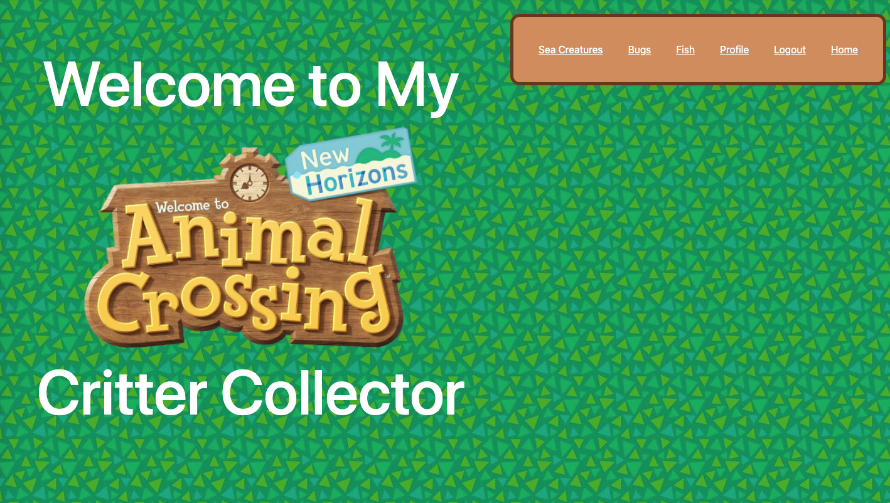

# [Animal Crossing Critter Collection](https://critter-collection.herokuapp.com/)

An app to help the user visually track which critters they have already caught in Animal Crossing: New Horizons. It also gives you information such as how many bells they're worth, the information you can get from Blathers, the mueseum curator, as well as the phrase the player says when they catch the creature. 


## How to SetUp locally

1. `Fork` and `Clone` this repository to your local machine
2. Open the directory in your text editor of choice for editing
3. Install dependencies and use the FS readfiles in the index.js to populate the       databases.


## Technologies

What was used to build this?
- HTML
- Javascript
- NodeJS
- Express
- Postgres
- CSS


## The User Story
The original User Story looked like this;

but I wasn't able to implement everything so it's changed to this;
### User Story
- As a user, I want to:
  - Be able to see a list of available critters
    - To see their specific information
  - Be able to update their capture status to reflect my in game experience


## ERD


I ended up not utilizing the Availability Tables but I'd like to in the future!
I utilized the [Animal Crossing: New Horizons API](http://acnhapi.com/) to populate the Fish, Bugs and Seacreatures databases. 


## The Wire Frames


## Some Screenshots of the Pages!


This is the page before logging into it


This is the page after logging into it


This is the index of all the fish, using EJS to loop through the database and print each bug seperately. 


On this page it shows the individual fish and their information that's listed in the database as well as it's capture status, and an opportunity to delete the data if you'd like, but is not reccommended.


With this page you can hit the button to change the fish's capture status to reflect your ingame status. To serve as a visual reminder that you've already caught it. 
In the future I'd like to implement color changes to better indicate when a specific critter is caught. 


## Some Code Snippets

This is the EJS code I used to display the complete list of items on the index page for the Bugs.
```
<body>
    <h1>BUGS</h1>
<div class="all">
    <% for( let i = 0; i < Bugs.length; i++) { %> 
        <div class="box">
        <% let bugs = Bugs[i]; %>
        <% bugs = bugs.toJSON() %>
            <a href="/bugs/<%= bugs.id %>"><%= bugs.name %></a>
            " />
            <a href="/bugs/edit/<%= bugs.id %>">Caught yet? <%= bugs.capture %> </a>
        </div>
    <% } %>
</div>   
</body>
```

This is the route used to display the Index Page for the Bugs
```
router.get("/", (req, res) => {
    Bugs.findAll()
    .then(function (bugsList) {
        console.log('FOUND ALL bugs');
        res.render('bugs/index', { Bugs: bugsList });
    })
    .catch(function (err) {
        console.log("ERROR", err)
        res.json({ message: "error occured, please try again"});
    });
});
```

This is the route for editing the Capture Status
```
router.put('/:id', function(req,res){
    let bugsIndex = Number(req.params.id);
    Bugs.update({
        capture: !req.body.capture
    }, { where: { id: bugsIndex} })
    .then(function(response){
        res.redirect(`/bugs/${bugsIndex}`);
    })
    .catch(function(err){
        console.log('ERROR', err);
        res.render('404', {message: "Update failed, try again?"})
    })
});
```

## Blockers

A problem I ran into was realizing that the data was not linked to individual users, and that anyone could edit it, logged in or not. 
I realized this late in the project and was unsure if I could fix it and still have enough time to finish.


## Future Plans

I'd like to repopulate the Heroku App to completely match my local database, and add in the Availability tables too, as well as to link data to individual users so that the pages would only reflect on what the user has changed for themselves!